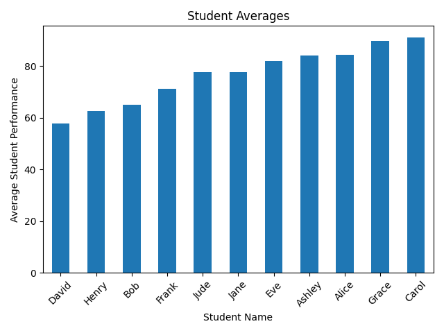
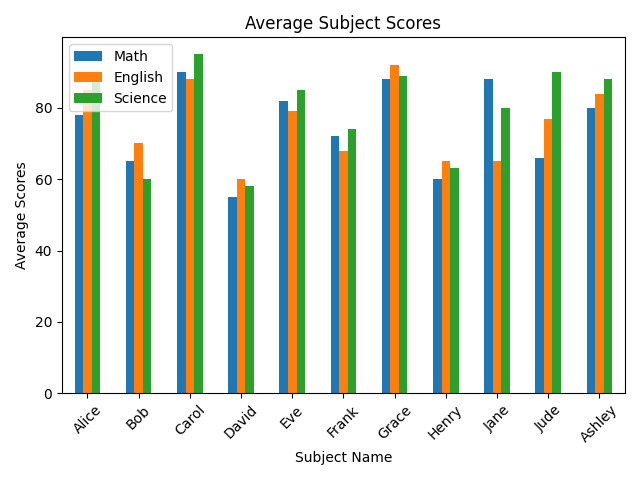
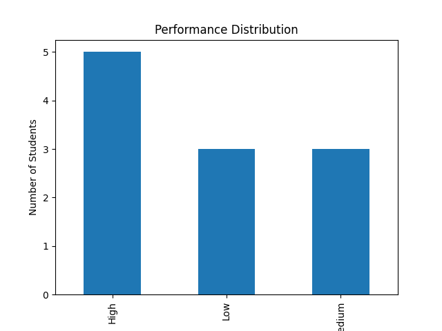

# 📊 Student Performance Dashboard

## 📌 Project Overview

This project is a Python-based data analysis dashboard that evaluates student performance across multiple subjects. It uses structured data from a CSV file to generate insights, rankings, and visualizations.

The goal of this project is to demonstrate foundational data analysis skills, including data cleaning, transformation, feature engineering, and visualization.

---

## 🎯 Features

* Loads and processes student data from a CSV file
* Calculates average score per student
* Identifies:

  * Best subject per student
  * Worst subject per student
* Classifies students into performance categories (High, Medium, Low)
* Ranks students based on overall performance
* Computes subject-level averages
* Generates visualizations:

  * 📈 Average score per student
  * 📊 Subject comparison per student
  * 📉 Performance distribution

---

## 🛠️ Technologies Used

* Python
* pandas
* matplotlib

---

## 📂 Project Structure

```
student-performance/
│── results_analyzer.py
│── results.csv
│── README.md
│── requirements.txt
│── results/
│   ├── average_scores.png
│   ├── subject_comparison.png
│   ├── performance_distribution.png
```

---

## ▶️ How to Run

1. Install dependencies:

   ```
   pip install -r requirements.txt
   ```
2. Ensure `results.csv` is in the project directory
3. Run the script:

   ```
   python results_analyzer.py
   ```

---

## 📊 Visualizations

### Average Score per Student



### Subject Comparison



### Performance Distribution



---

## 🔍 Key Insights

* Certain subjects show consistently higher average performance across students
* Most students fall within the **Medium performance** category
* High-performing students tend to perform well across all subjects
* Performance distribution highlights variation in student strengths and weaknesses

---

## 🧠 Skills Demonstrated

* Data analysis using pandas
* Data cleaning and preprocessing
* Feature engineering (averages, categories)
* Data visualization using matplotlib
* Structuring a Python project for real-world use

---

## 🚀 Future Improvements

* Add more subjects and larger datasets
* Implement interactive visualizations (e.g., dashboards)
* Integrate basic machine learning models for performance prediction
* Export analysis results to reports (PDF/CSV)

---

## ✨ Author

Developed as part of a learning journey into data analysis, machine learning, and software development.
